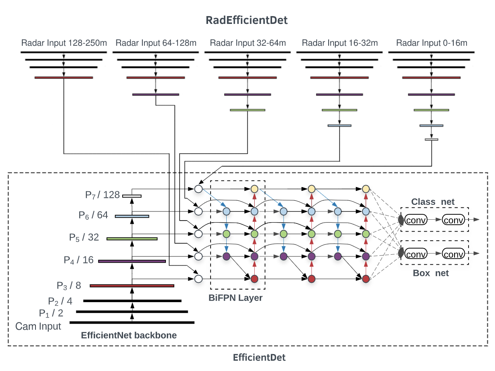
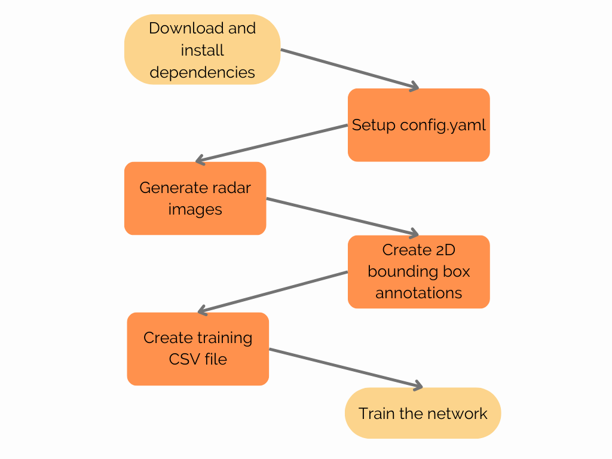

# RadEfficientDet
A Deep Learning architecture for obstacle detection fusing Camera and Radar data based on EfficientDet. This project
is based on [the Keras implementation of EfficientDet by xuannianz](https://github.com/xuannianz/EfficientDet) and is
trained using the [Nuscenes dataset](https://www.nuscenes.org/).

In RadEfficientDet, the radar detections are split into 5 different intervals, depending on the distance of the detection.
These detections are then represented as images and are input into EfficientDet before the Bi-FPN section.

The full process to train RadEfficientDet on NuScenes goes as follows:

## Requirements:
- Python 3.8
- [Nuscenes dataset](https://www.nuscenes.org/)
- Dependencies in **requirements.txt**

To install the dependencies automatically:
`pip install -r requirements.txt`

# 1. Setup config.yaml

To setup the data, training and directory structure configuration, we apply our changes to the config.yaml file. The
most important parameters to change are:

nuscenes_dir: Directory where the NuScenes database is located
dataset_version: Choose between 'v1.0-mini' or 'v1.0-trainval'
dataset_save_dir: Where to save new images and files for the current dataset you're working on.

The first step is to generate images that include the radar data. To do so, we must access all the camera images in the nuscenes dataset, project the radar data onto them, and save them to a directory.

# 2. Generate radar images

Change any parameters in the **FUSION** section of the config.yaml file, and run:

`python3 dataset_preprocessing/fusion.py`

This will create the new images with the desired configuration and will save them to your dataset_save_dir. If show_images
is set to True in the config file, the images will be displayed on a window instead of being saved.

# 3. Generate JSON file with 2D bounding box annotations

The NuScenes dataset is annotated in 3D, but we need 2D annotations for this architecture. Thankfully, the nuScenes SDK
provides a script to project these annotations automatically. This has some inconveniences though (untight bounding 
boxes and objects without visibility).

To generate the JSON file in your dataset_save_dir:

`python3 dataset_preprocessing/export_2d_annotations_as_json.py`

# 4. Generate dataset CSV file

This architecture uses a generator to import the data into the network when training. Said generator requires a CSV file
with one annotation per line. We can create said CSV file by running:

`python3 dataset_preprocessing/generate_dataset_csv.py`

# 5. Train the network

The `Radar` directory contains all the files pertaining to RadEfficientDet.

The `Camera` directory contains all the files pertaining to EfficientDet.

Both are fully included for comparison purposes. We can thus train both the Radar-Fusion model and the
Camera-only baseline to compare the evaluation results between them.

To train any of the networks, run:

`python3 Radar/train.py`

or

`python3 Camera/train.py`

# 6. Evaluate the results

To evaluate the performance of your checkpoint:

`python3 Radar/rad_evaluate.py`

or 

`python3 Camera/cam_evaluate.py`